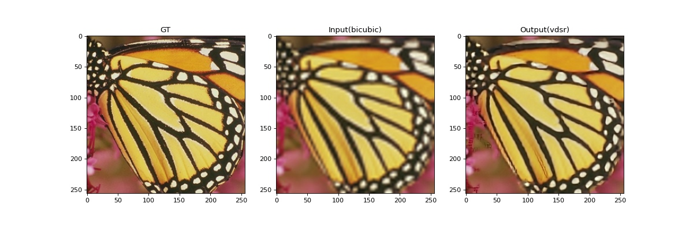

# MTK lab - Super Resulotion (VDSR)

## Installation
    $ pip3 install -r requirements.txt

  Download the training data [here](https://drive.google.com/drive/folders/1jShBiFxqAETak2n0W2zYAq1f19Dio94G?usp=sharing) and put it in [/data](./data)

## Inference
See [inference.ipynb](./inference.ipynb)

<div align="center">
    
</div>

## Training
See [train.ipynb](./train.ipynb)

Run [generate_train.m](./data) by using Matlab, you can generate your own training data (train.h5).

## Reference
```
@misc{github,
  author={twtygqyy},
  title={pytorch-vdsr},
  year={2018},
  url={https://github.com/twtygqyy/pytorch-vdsr},
}
```